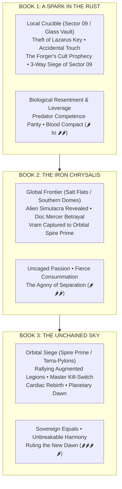

# The Storm-Born Cycle: Master Trilogy Architecture

> **Genre:** Biopunk Romantasy / High-Stakes Sci-Fi  
> **Timeline:** Year 40 AS (forty years After the Storm)  
> **Protagonists:** **Dr. Tsunari Thorne** ("Tsune" / "Tsunie") & **Commander Vram Tyage** ("Vram" / "Pyre-Zero")  
> **Format:** Three Full-Length Novels | Dual POV (First-Person or Third-Person Limited Alternating)

---

## 1. Executive Trilogy Vision & Themes

*   **Theme 1: Autonomy vs. Conditioning & Fanaticism:** The struggle of engineered weapons (Vram, chimeric soldiers) and hunted survivors (Tsunari, Gray Sector) to reclaim their minds, identities, and bodies—refusing both corporate enslavement (Apex GeneSys) and apocalyptic cult deification (The Enlightened / The Forger).
*   **Theme 2: The Fire & Shadow Polarity:** An intimate biopunk symbiosis. Vram’s 106°F Phoenix furnace brings warmth, pyric shielding, and raw kinetic power; Tsunari’s cool Raptor physiology and Null-Resonance provide lethal agility and the soothing biological cure that saves his sanity.
*   **Theme 3: The Subversion of Romance Clichés:** The bond progresses from biological shame, humiliation, and hostage leverage to earned predator competence parity, the psychological terror of mental silence, and an unvoiced blood compact of equals.
*   **Theme 4: The Reconstruction of Truth:** Moving from the localized lies of Sector 09 to the global conspiracy of the alien *Simulacra*, culminating in the liberation of planetary air and the rebirth of humanity.

---

## 2. Book-by-Book Overview

### Book 1: *A Spark in the Rust*
*   **Core Setting:** Eden Dome Alpha perimeter, Sector 09 Gray Ring, Redoubt Station 14, Rust Barrens, Sump Drainage Networks, and The Glass Vault.
*   **Primary Conflict:** Vram hunts Tsunari as a corporate executioner; an accidental touch during combat shuts off his agonizing lattice fever. To understand the cure, he defies orders, abducts her, and is pursued into the Rust Barrens. In the sump underbelly, **The Forger** (High Priestess of **The Enlightened**) proclaims Vram the prophesied "Apex Deliverer" and offers him an army to burn the Dome if he sacrifices Tsunari ("The Cold Serpent").
*   **Key Antagonists & Secondary Arcs:** 
    *   *Corporate & Alien Oppression:* Director Elena Corvus (Apex GeneSys) & Archon Xaevis’s field Inquisitors.
    *   *Religious Demagogues & Enforcers:* The Forger and Commander Malakar (Ember-Prime, wielding his pneumatic rail-flail in an epic duel before vanishing into the deep sumps).
    *   *The Tragic Rival / Redemptive Ally:* Caelia (Ember-Seven / "The Promised Bride")—initially an obsessive, jealous cultist groomed to marry the Deliverer who hates Tsunari, but who ultimately defects and sacrifices everything to save them for simple, imperfect human love.
*   **Climactic Battle:** The Three-Way Siege of Sector 09. Consortium automated drone platforms and wall artillery drop incendiary sweeps from above while Malakar and the Ember Coven breach from the sumps beneath. Vram, Aeros-Legion 7, Tsunari, and Gideon's Bio-Curators fight in the middle, breaking both corporate and cult traps.
*   **Ending State:** Sector 09 secures a temporary sanctuary. Caelia is stabilized and granted freedom among the Gray Sector scouts; Malakar’s whereabouts remain a lurking mystery in the wastes. Vram and Tsunari are united as rogue partners bound by an unvoiced blood compact. The first localized neural stabilizer is proven, but global extinction remains 12 months away.

### Book 2: *The Iron Chrysalis*
*   **Core Setting:** The Torrid Kiln, radioactive Salt Flats, Southern Dome Clusters (Dome Meridian), and subterranean rebel networks.
*   **Primary Conflict:** Expanding the rebellion globally while synthesizing an aerosolized cure. Paranoia rises as corporate leaders and resistance commanders act with inhuman cruelty—revealing the horrifying presence of **Vaelen Simulacra** (extraterrestrial organisms wearing cloned human flesh).
*   **Key Antagonist:** Weaver-Unit 09 (Doc Mercer unmasked) & the Consortium Director Board.
*   **Key Ally:** Arbiter Lyraen (dissident leader of the Vaelen Preserver movement).
*   **Climactic Battle & Dark Night:** The Betrayal at the Rebel Headquarters. Mercer unmasks himself as a Simulacrum. Vram holds off an entire battalion alone so Tsunari and young Ren can escape with the synthesized cure. Vram is hauled into the sky in titanium chains, bound for orbital Spire Prime.
*   **Ending State:** Complete emotional devastation and the ultimate test of devotion. Tsunari vows to rally humanity and tear the sky down to rescue Vram.

### Book 3: *The Unchained Sky*
*   **Core Setting:** High-altitude atmospheric warfare, Spire Prime (alien orbital flagship), Spire Meridian, and the planetary Terra-Pylon core.
*   **Primary Conflict:** Launching a planetary uprising. Tsunari inoculates hundreds of chimeric soldiers with the aerosol cure, creating a combined armada of freed soldiers and Gray Sector survivors. They storm the orbital Spire to rescue Vram and destroy the terraforming grid.
*   **Key Antagonist:** Archon Xaevis (Supreme Vaelen Commander) and the Harvester armada.
*   **Climactic Battle:** The Throne Chamber of Spire Prime. Xaevis activates Vram’s neural kill-switch; Vram flatlines, triggering his Phoenix cardiac auto-defibrillation (*The Rebirth*) as Tsunari pierces his siphon port with the master antidote. Vram rises in uninhibited solar fire.
*   **Ending State:** Archon Xaevis is defeated. The terra-pylons are reversed, neutralizing the toxic sulfur haze. The Green Domes open, and clean, natural rain falls across Earth for the first time in forty years. Vram and Tsunari stand together beneath an open sky.

---

## 3. The 3-Book Romance Heat & Trajectory

| Phase | Book 1: *A Spark in the Rust* | Book 2: *The Iron Chrysalis* | Book 3: *The Unchained Sky* |
| :--- | :--- | :--- | :--- |
| **Romantic Dynamic** | Biological Resentment $\rightarrow$ Competence Parity $\rightarrow$ Terror of Silence $\rightarrow$ Blood Compact | Uncaged Devotion & Passion Tested by Extraterrestrial Betrayal | Sovereign Equals / Unbreakable Union |
| **Heat Level** | 🌶️ to 🌶️🌶️ (Tension, Fever Triage, Near-Kiss) | 🌶️🌶️🌶️ (Geothermal Haven Consummation) | 🌶️🌶️🌶️🌶️ (Touch-Starved Reunion & Sovereign Surrender) |
| **Key Tropes** | Accidental Shock, Humiliating Dependency, Hostage Leverage, "Who Did This To You?", Sovereign Refusal | Bed Sharing on the Run, Fierce Consummation, Forced Separation, Desperate Sacrifice | The Grand Orbital Rescue, Touch-Starved Reunion, Battle Couple |
| **Naming Milestones** | "The Captive / Anomaly" $\rightarrow$ "Thorne" $\rightarrow$ "Tsune" / Unvoiced Compact | "Tsune" & "Ty" in combat $\rightarrow$ Whispered *"Tsunie"* in raw intimacy | Unshakeable mutual devotion $\rightarrow$ Two halves of one soul |

---

## 4. Character Evolution Across the Trilogy

### Dr. Tsunari Thorne ("Tsune" / "Tsunie")
*   **Book 1:** A solitary, calculating survivalist who trusts only kinetic speed and cold odds. Learns that relying on a radiant, protective counterweight makes her a formidable, sovereign leader. Rejects both corporate propaganda and cult demagoguery.
*   **Book 2:** A tactical commander grappling with the shattering betrayal of her surrogate father (Doc Mercer). Transforms grief into unyielding, lethal resolve.
*   **Book 3:** A legendary revolutionary who masters her Quantic Phase-Stutter at scale, leading an orbital assault to rescue the man she loves and liberate humanity.

### Commander Vram Tyage ("Vram" / "Pyre-Zero")
*   **Book 1:** A leashed corporate executioner living in blinding neuro-pain. Discovers through Tsunari’s touch that he is a human being with a soul. Rejects The Forger's false messianic throne and Elena Corvus's leash, choosing autonomous partnership beside Tsunari.
*   **Book 2:** A protective, deeply devoted partner whose feral protectiveness is pushed to the limit. Sacrifices his own freedom so she can live.
*   **Book 3:** Endures torture in the orbital spires without breaking. Undergoes the mythic Phoenix rebirth, destroying his alien leash and stepping into his destiny as a free leader.

### Aeros-Legion 7 (Cassian, Veda, Ferrin Calder, Toby Vance) & Allies (Boran, Madame Chen, Kira)
*   **Book 1:** Suspicious, conditioned soldiers following orders out of fear. Joined by undercity allies (Boran, Madame Chen, Kira Brandt), they choose Vram and defect after experiencing neural clarity from Tsunari's prototype stabilizer.
*   **Book 2:** Operating as a mobile guerilla strike force across the global wasteland; confronting the reality of their chimeric origins and battling corporate purge teams.
*   **Book 3:** The frontline vanguard leading the assault on the orbital spires, awakening thousands of fellow chimeric soldiers worldwide.
