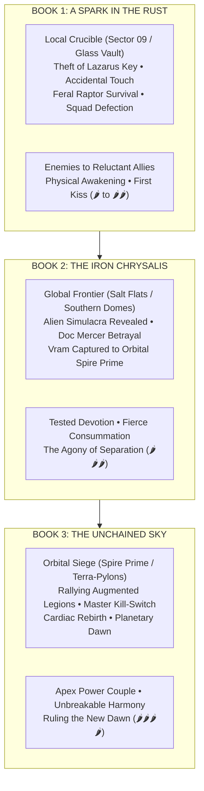

# The Storm-Born Cycle: Master Trilogy Architecture

> **Genre:** Biopunk Romantasy / High-Stakes Sci-Fi  
> **Timeline:** Year 18 AS (After the Storm)  
> **Protagonists:** **Dr. Tsunari Thorne** ("Tsune" / "Tsunie") & **Commander Vram Tyage** ("Vram" / "Pyre-Zero")  
> **Format:** Three Full-Length Novels | Dual POV (First-Person or Third-Person Limited Alternating)

---

## 1. Executive Trilogy Vision & Themes

*   **Theme 1: Autonomy vs. Conditioning:** The struggle of engineered weapons (Vram, chimeric soldiers) and hunted survivors (Tsunari, the Gray Sector) to reclaim their minds, identities, and bodies from corporate and alien masters.
*   **Theme 2: The Fire & Shadow Polarity:** An intimate biopunk symbiosis. Vram’s 106°F Phoenix furnace brings warmth and raw kinetic power; Tsunari’s cool Raptor physiology and Null-Resonance provide lethal agility and the soothing biological cure that saves his sanity.
*   **Theme 3: The Reconstruction of Truth:** Moving from the localized lies of Sector 09 to the global conspiracy of the alien *Simulacra*, culminating in the liberation of planetary air and the rebirth of humanity.

---

## 2. Book-by-Book Overview

### Book 1: *A Spark in the Rust*
*   **Core Setting:** Eden Dome Alpha perimeter, Sector 09 Gray Ring, Redoubt Station 14, Rust Barrens, and The Glass Vault.
*   **Primary Conflict:** Vram hunts Tsunari as a corporate executioner; an accidental touch during combat shuts off his agonizing lattice fever. To understand the cure, he defies orders, abducts her, and eventually defects with his flight squadron.
*   **Key Antagonist:** Director Corvus (Consortium) & Archon Xaevis’s field Inquisitors.
*   **Climactic Battle:** The Siege of the Glass Vault. Vram’s squadron (Aeros-Legion 7) breaks their mental leash and joins Vram and Tsunari to defend the subterranean archive against Consortium extermination squads.
*   **Ending State:** Sector 09 secures a temporary sanctuary. Vram and Tsunari are united as rogue partners. The first localized neural stabilizer is proven, but global extinction remains 12 months away.

### Book 2: *The Iron Chrysalis*
*   **Core Setting:** The Torrid Kiln, radioactive Salt Flats, Southern Dome Clusters (Dome Meridian), and subterranean rebel networks.
*   **Primary Conflict:** Expanding the rebellion globally while synthesizing an aerosolized cure. Paranoia rises as corporate leaders and resistance commanders act with inhuman cruelty—revealing the horrifying presence of **Vaelen Simulacra** (extraterrestrial organisms wearing cloned human flesh).
*   **Key Antagonist:** Weaver-Unit 09 (Doc Mercer unmasked) & the Consortium Director Board.
*   **Key Ally:** Arbiter Lyraen (dissident leader of the Vaelen Preserver movement).
*   **Climactic Battle & Dark Night:** The Betrayal at the Rebel Headquarters. Mercer unmasks himself as a Simulacrum. Vram holds off an entire battalion alone so Tsunari and young Ren can escape with the synthesized cure. Vram is hauled into the sky in titanium chains, bound for orbital Spire Prime.
*   **Ending State:** Complete emotional devastation and the ultimate test of devotion. Tsunari vows to rally humanity and tear the sky down to rescue Vram.

### Book 3: *The Unchained Sky*
*   **Core Setting:** High-altitude atmospheric warfare, Spire Prime (alien orbital flagship), Spire Meridian, and the planetary Terra-Pylon core.
*   **Primary Conflict:** Launching a planetary uprising. Tsunari inoculates hundreds of chimeric soldiers with the aerosol cure, creating a combined armada of freed soldiers and Gray Sector survivors. They storm the orbital Spire to rescue Vram and destroy the terraforming grid.
*   **Key Antagonist:** Archon Xaevis (Supreme Vaelen Commander) and the Harvester armada.
*   **Climactic Battle:** The Throne Chamber of Spire Prime. Xaevis activates Vram’s neural kill-switch; Vram flatlines, triggering his Phoenix cardiac auto-defibrillation (*The Rebirth*) as Tsunari pierces his siphon port with the master antidote. Vram rises in uninhibited solar fire.
*   **Ending State:** Archon Xaevis is defeated. The terra-pylons are reversed, neutralizing the toxic sulfur haze. The Green Domes open, and clean, natural rain falls across Earth for the first time in eighteen years. Vram and Tsunari stand together beneath an open sky.

---

## 3. The 3-Book Romance Heat & Trajectory

| Phase | Book 1: *A Spark in the Rust* | Book 2: *The Iron Chrysalis* | Book 3: *The Unchained Sky* |
| :--- | :--- | :--- | :--- |
| **Romantic Dynamic** | Enemies to Reluctant Allies to Lovers | Deepening Bond Tested by Betrayal | Apex Equals / Power Couple |
| **Heat Level** | 🌶️ to 🌶️🌶️ | 🌶️🌶️🌶️ | 🌶️🌶️🌶️🌶️ |
| **Key Tropes** | Accidental Touch, Knife-to-Throat, Caretaking, Feral Protection | "Who Did This To You?", Bed Sharing on the Run, Forced Separation | The Grand Rescue, Touch-Starved Reunion, Battle Couple |
| **Naming Milestones** | "The Anomaly" $\rightarrow$ "Thorne" $\rightarrow$ "Tsune" / First kiss in the bunker | "Tsune" & "Ty" in battle $\rightarrow$ Whispered "Tsunie" in raw intimacy | Unshakeable mutual devotion $\rightarrow$ Two halves of one soul |

---

## 4. Character Evolution Across the Trilogy

### Dr. Tsunari Thorne ("Tsune" / "Tsunie")
*   **Book 1:** A solitary, calculating survivalist who trusts only kinetic speed and cold odds. Learns that relying on a radiant, protective counterweight makes her an apex leader.
*   **Book 2:** A tactical commander grappling with the shattering betrayal of her father figure (Doc Mercer). Transforms grief into unyielding, lethal resolve.
*   **Book 3:** A legendary revolutionary who masters her Quantic Phase-Stutter at scale, leading an orbital assault to rescue the man she loves and liberate humanity.

### Commander Vram Tyage ("Vram" / "Pyre-Zero")
*   **Book 1:** A leashed corporate executioner living in blinding neuro-pain. Discovers through Tsunari’s touch that he is a human being with a soul, choosing treason to keep her safe.
*   **Book 2:** A protective, deeply devoted partner whose feral protectiveness is pushed to the limit. Sacrifices his own freedom so she can live.
*   **Book 3:** Endures torture in the orbital spires without breaking. Undergoes the mythic Phoenix rebirth, destroying his alien leash and stepping into his destiny as a free leader.

### Aeros-Legion 7 (Cassian, Veda, Jax)
*   **Book 1:** Suspicious, conditioned soldiers following orders out of fear. Choose Vram and defect.
*   **Book 2:** Operating as a guerilla strike force; confronting the reality of their chimeric origins.
*   **Book 3:** The frontline vanguard leading the assault on the orbital spires, awakening thousands of fellow soldiers.
